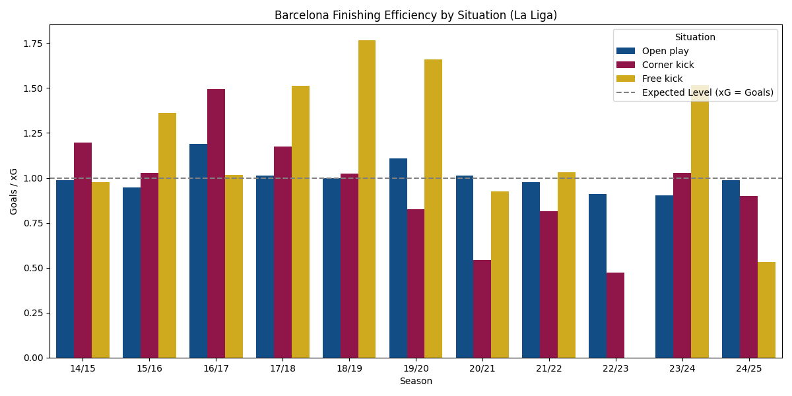

# Project Title: Performance Analysis of FC Barcelona - A Decade of Evolution and Recurring Challenges in Competitions

## Project Overview and Motivation

Following their peak in the 2014/15 treble-winning season, FC Barcelona entered a turbulent period marked by declining performance, high transfer expenditure, and financial instability. The analysis integrates multiple datasets and uses Python for data cleaning, visualization, and correlation analysis. It highlights key turning points, including the post-Messi era, financial crises, and managerial changes, offering a data-driven perspective on the club’s evolution.

- **Key Highlights:**
- Interactive and static visualizations for domestic and international performance.
- Evaluation of finishing efficiency based on xG and goal metrics.
- Financial analysis linking transfer spending and squad cost limit to on-field results.
- Correlation analysis revealing how financial constraints influenced performance trends.

The goal is to provide a data-driven explanation of Barcelona’s transition from European dominance to instability and ongoing rebuilding.

## Tools and Technologies

- **Python:** pandas, numpy, matplotlib, seaborn
- **Jupyter Notebook**
- **Github** for version control and project sharing
- (Optional) **Plotly** for interactive visualizations  

## Techniques & Skills Demonstrated

- Multi-source data integration
- Cleaning & preprocessing (column standardization, numeric conversions, deduplication)
- Feature engineering:
  - Standardized season format (e.g., 2014/15 → 14/15)
  - Finishing & defensive efficiency metrics (GF/xG, GA/xGA)
  - Aggregated season-level datasets for combined analysis
- Exploratory Data Analysis (EDA)
- Statistical & trend analysis
- Correlation analysis
- Interactive visualizations (Plotly, when relevant)

## Key Analysis and Findings

### 🔵 Declining attacking output (post-2016)

- Goals scored peak between 14/15 and 16/17, and then declined gradually, reaching the lowest in 2022.

### 🔴 Defensive Weaknesses

- Goal difference decreased steadily after the 14/15 season.
- 21/22 marked the lowest level in FC Barcelona's performance, with low goals scored but high goals conceded.
- Improvement under Xavi (22/23) but inconsistency remains

### 🟡 Finishing Efficiency (Expected Goals vs Goals-For)

- Open-play efficiency dropped below 1.0 after 19/20
- Set-piece efficiency weakened dramatically after 2021, coincided with Messi departure, showing reliance on key players

### 🔵 UEFA Chaampions League Performance

- 8 eliminations in Quarter/Semi finals since 2015
- Demoted to Europa League in 21/22 and 22/23, Round of 16 failure in 21/22 and Round of 32 failure in 22/23
- Goals scored improved recently, but knockout failures persist

### 🟠 Financial Context

- Over €1.1B spent between 2016–2020 with minimal impacts and poor returns on investments
- Squad Cost Limit collapsed after 2020, reaching negative levels in 2021/22.
- Financial restrictions directly correlate with weaker on-field performance.

## Visualization

### La Liga Performance

- **Performance trends** (Total Goals vs Rank)

- **Defensive Weakness** (Goals-For, Goals-Against, Goals-Difference):

  > **Note:** This is a [basic interactive plot](outputs/html/goals_vs_ga.html), you can interact with it by upload this notebook to Google Colab.

- Finishing Efficiency (Goals-For vs Expected Goal):

### UCL Performance

### Financial

- **Transfer Spend (M€)**

  
- **Squad Cost Limit (M€)**

## Conclusion

FC Barcelona’s decline cannot be explained by performance metrics alone. Instead, the combined analysis shows:

- Squad mismanagement (2017–2020) created structural weaknesses
- Financial collapse (2020–2022) restricted squad-building capacity
- Efficiency declines (finishing and defensive) negatively impacted results
- UCL performance drop mirrors domestic instability
- Financial flexibility strongly predicts competitive performance

The project demonstrates how long-term football performance can only be understood by combining data, context, and finance.

## How to run

- Clone the repo
- Install dependencies (pandas, matplotlib, seaborn)
- Open FCB_performance_analysis.ipynb in Jupyter Notebook
- For interactive charts, run in Google Colab or a local environment with Plotly installed.

## Limitations & Potential Improvements in The Future

**Limitations:**

- Limited dataset granularity: match-level stats and player-level contributions are not considered
- Some financial data, like exact salary breakdowns or revenue, are unavailable or approximate.

**Future Work:**

- Integrate match-level or player-level datasets for advanced metrics (e.g., xGA, pressing, possession).  
- Explore advanced visualization tools (interactive dashboards like Power BI) for deeper storytelling.  
- Compare FC Barcelona to other top clubs over the same decade to identify structural differences.
