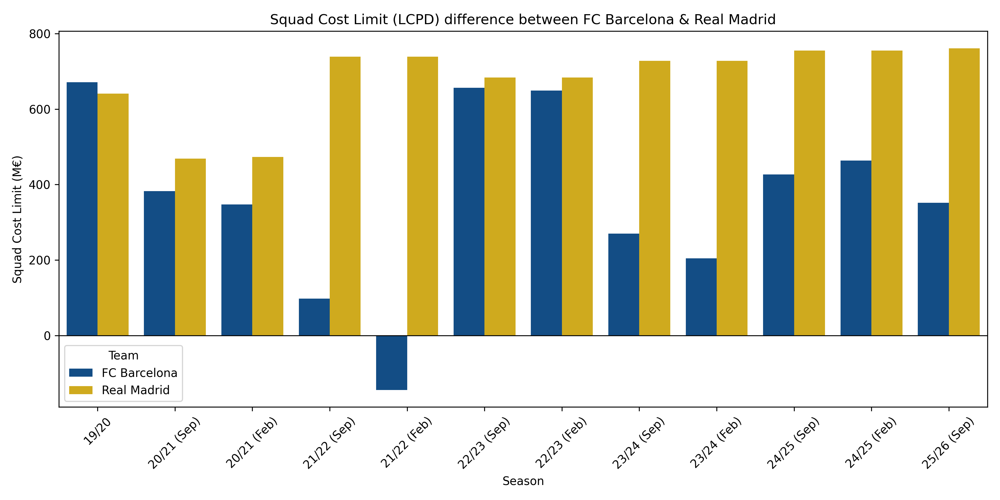

  

    
  

<h1 align="center">
    Performance and Financial Analysis of FC Barcelona
     
    
        A Decade of Evolution and Recurring Challenges in Competitions
    
</h1>

## Background & Overview
After the historic treble in 2014/15, FC Barcelona faced a decade of highs and lows. On-field performance fluctuated, defensive stability declined, and financial instability forced major structural adjustments. This project investigates the club’s:

- Competitive performance in domestic (La Liga) and international (UEFA Champions League) competitions
- Finishing efficiency and Defensive weaknesses
- Financial constraints, including transfer spending and salary cap limits, and their influence on team outcomes

The analysis aims to uncover how financial and operational decisions correlate with on-field performance, offering insights relevant to business strategy and operational efficiency.

**Research Question**:

`How did FC Barcelona go from European dominance to financial and competitive instability, and what factors explain their decline and recovery?`

## Data Overview

- **La Liga season-level Stats (2014–2024/25)** - Contains season-by-season performance metrics such as Goals For (GF), Goals Against (GA), Goal Difference (GD), and final league rank
- **Deeper ball situations breakdown** - Open play, free kicks, corners & Expected Goals (xG) based on situation
- **UEFA Champions League Stats (2014–2024/25)** - Includes stage progression (Group Stage, Round of 16, QF, SF, Final), goals, and match outcomes
- **Transfer Market Data** - Transfer spend (€M)
- **Squad Cost Limit Data** - Published by La Liga, defines the maximum amount clubs can spend on salaries, amortization, and agent fees.

`Note: Squad Cost Limit is officially published from 2019/20 onwards.`

## Executive Summary

This project provides a decade-long evaluation of FC Barcelona’s performance, efficiency, and financial health. The visualization above highlights the main takeaways:

1. **Performance Decline After 2016**:

   - Attacking and defensive efficiency steadily decreased post-2016
   - Lowest domestic and international performance in 2021/22:
     - Goals scored: 68 (lowest in decade)
     - Goals conceded: 38 (second highest)
     - Win rate in La Liga: 55.26%
     - UEFA Champions League: eliminated in group stage → UEFA Europa League (UEFA)
2. **Recurring Challenges at International Competitions**:

   - 7 eliminations in UCL knockout rounds
   - 2 relegations to Europa League
   - Defensive inconsistencies and tactical gaps persisted despite attacking improvements
3. **2020–2022 Financial Crisis**:

   - Overspending in transfers: €1.1B spent from 2015/16–2020/21 (peak €413M in 2017/18)
   - COVID-19 revenue losses + prior mismanagement → salary cap restrictions and reduced squad renewal
   - Post-2020: transfer spending sharply decreased, financial pressure limited team competitiveness
4. **Rebuilding Era (2022-Present)**:

   - Goals scored and win rates improved domestically
   - UCL progress remains limited due to defensive vulnerabilities
   - Financial restrictions continue to affect transfer strategy and squad depth

> This is an interactive dashboard created by `plotpy`. Run in Google Colab or a local environment with Plotly installed to explore more information on the plot.

## Insight Deep Dive & Visualizations

### 🟣 Insights About FC Barcelona's Performance in Domestic Competition over The Past Decade

- Barcelona’s attacking output peaked between 2014 - 2017 with highest goals scored is 116, after which total goals declined sharply until the lowest point in 2021/22, declined 41% compared to their peak season.
- Despite fluctuations in goals scored, league rank did not always follow the same pattern, indicating that defensive stability and match consistency also played a crucial role in match and league outcomes.
- The 2022/23 rebound (fewer goals but improved ranking) reflects tactical restructuring, prioritizing compact defense over pure attacking output.

### 🟡 Insights About Their Weakenesses in Defense Based on Scoring Trends

- The line charts above illustrate goals distribution of FCB over the past 10 years. As shown by 2nd chart, the goal difference (goals scored - goals against) decreased gradually after 2016. This indicates that although the team maintained strong attacking numbers throughout the decade, but goals conceded increased steadily after 2016, reducing goal difference each season.
- The 2021/22 season shows the most severe imbalance: lowest goals scored (68) + unusually high goals conceded (38), producing the decade’s lowest goal difference.
- The 2022/23 season marked a defensive turnaround as goals conceded dropped to the lowest level in 10 years (20 GA), coinciding with managerial and tactical changes.
- However, the subsequent 23/24 season raised questions about their consistency. Despite tactical improvement, the team’s defensive performance deteriorated, with goals conceded reaching their highest level in a decade (44). This suggests that besides manager - other factors such as player dependency or financial situation - may have influenced their on-pitch performance, especially in defense.

### 🔴 Insights About Their Finishing Efficiency Based on Goals-For (GF) and Expected-goals (xG)

- The analysis of FC Barcelona finishing efficiency based on Goals-For (GF) and Expected Goals (xG) across different ball situation reveal distinct patterns in the team's attacking performance over the last 10 years. Efficiency is measured as the ratio of Goals-For (GF) to Expected Goals (xG) (`GF/xG`), where a ratio above 1 indicates overperformance and below 1 indicates underperformance.
- **Open play:** Involving the play of live ball, usually contributes the majority of goals of any team. From **2014–2019**, Barcelona slightly overperformed xG in open play, indicating high finishing quality from elite forwards. After **2019/20**, open-play finishing efficiency dropped below 1.0, suggesting fewer clinical chances converted despite similar chance volume.
- **Set pieces:** Corner kick and freekick are usually parts of set piece but analyzing them separately will provides better understanding and visualization of their performance trend. FC Barcelona showed strong execution in dead-ball scenarios between 2014 and 2019, especially in freekick with an average of 1.38 GF/xG. However, freekick efficiency declined sharply after Messi’s departure (2020), confirming strong dependency on a key player.
- **Overall trend:** Overall finishing inefficiency post-2020 likely contributed to point losses in closer matches, especially when combined with defensive issues. However, finishing inefficiency, particularly post-2020, may have cost Barcelona decisive points in both domestic and international competitions.

### 🔵 Insights About Their International Performance

- Since the 2014/15 UCL title, Barcelona consistently struggled in knock-out rounds of UEFA Champions League, with **7 early exits in the last 10 seasons**.
- Their performance fluctuated post-2018/19 and reached lowest level in 2021/22.They were demoted to the Europa League in 2021/22 and 2022/23 after failing the group stage at UCL, highlighting the club was unable to compete at high-level competition intensity during its financial crisis.
- Although goals scored slightly improved the following seasons, defensive collapses in key matches (e.g., away legs) severely limited UCL progression.
- The 2024/25 run again emphasizes a persisten weakness in defense with highest goals scored but also highest goals conceded in 10 years and again eliminated in Semi-Finals.
- While their attacking performance significantly improves and remains relatively strong, defensive vulnerabilities at decisive moments continue to limit their success in international competitions.

### 🟠 Insights About Amount Spending on Transfer Market

- From 2014 to 2020, the club maintained a stable financial status, reflected in consistently high levels of transfer spending and the freedom to pursue marquee signings. Between 2016–2020, Barcelona spent over €1.1B, specifically in 2017 when they spent more than 3 times of their previous transfers with multiple high-cost contracts in an attempt to replace Neymar's impact after his departure but fail to match expectations. This also marks the beginning of financial instabilities and highlights inefficiencies in recruitment strategy, talent integration, and financial management.
- Since 2020, their transfer sum decreased significantly after years of excessive spending, COVID-19 revenue losses, and structural mismanagement, forcing reliance on free transfers and academy players as the results of La Liga salary cap restrictions.
- Spending patterns mirror performance cycles: overspending → inefficiency → collapse → rebuilding
- **Overall**, this analysis demonstrates that Barcelona’s current financial struggles are not isolated incidents but rather the cumulative result of poor transfer market management during their most lavish years. The reduction in transfer expenditure after 2020 was less a matter of choice than a reflection of financial necessity, marking the beginning of a new, restrictive phase shaped by La Liga’s economic controls.

### 🟢 Insights: Comparison of Squad Cost Limit between FC Barcelona and Real Madrid

- The analysis of FC Barcelona's financial situation can be interpreted further by its Squad Cost Limit in La Liga compared to their rival, Real Madrid. Squad Cost Limit (LCPD) is a measure set by La Liga which define the maximum amount a club may spend on registered players, coaching staff, and youth system expenses (including salaries, amortizations, and agent fees).
- From 2019 to current season, FC Barcelona's Squad Cost Limit experienced major fluctuations that closely reflects their sporting performance trends:
  - Barcelona’s Squad Cost Limit collapsed from €671M (19/20) to negative levels in 21/22, forcing the club under a restrictive “1:4” - allowing only 25% reinvestment of income rule - limiting their ability to renew contract of key players such as Messi and and sign new high-quality contracts.
  - In the 2022/23 season, the club saw a temporary recovery of the limit due to the activation of the four "economic fever", including the sales of 25% of future television rights and other assets of the club such as 49% of Barça Studio. The limit rebounded to €656M, supporting key transfer and winning the La Liga title of the season.
  - However, financing the club's future can only exchange for short-term liquidity as from 2023/24 til recently, the club's financial situation continues fluctuating. Although the Squad Cost Limit initially improved in 24/25, it declined slightly this current season (25/26). Unvalidated revenue from the sale of VIP seats and delayed return to the Spotify Camp Nou reduced expected income, limiting summer transfer signings.
- Real Madrid, meanwhile, remained stable above €700M after experiencing slightly declined in 20/21 due to COVID-19, highlighting divergent financial trajectories between the two rivals.
- **Overall**: Financial constraints correlate with performance: poorer seasons coincide with the lowest salary caps, restricted transfer activity, and reduced squad depth.

### Correlation Between Financial Constraints and Team Performance

- Positive correlation between Squad Cost Limit and Win Rate, showing financial flexibility improves competitive performance. While transfer spending & win rate shows weaker correlation, reinforcing that the problem wasn’t money spent, but **money spent inefficiently**.
- Financial and performance variables align strongly after 2020, indicating the club’s competitive decline was deeply tied with financial, not only tactical.

## Conclusion

FC Barcelona’s decline cannot be explained by performance metrics alone. Instead, the combined analysis shows:

- Squad mismanagement (2017–2020) created structural weaknesses
- Financial collapse (2020–2022) restricted squad-building capacity
- Efficiency declines (finishing and defensive) negatively final outcomes
- UCL performance drop mirrors domestic instability
- Financial flexibility strongly predicts competitive performance
- Overall, the **correlation between financial constraints and team performance** is evident: Financial restrictions have reduced squad's depth as the club is unable to sign high-quality players, increasing dependence on current key players, who shouldn’t be expected to perform in every match.
- **Key Takeaways**:

`Business lesson: Operational and financial efficiency are as critical as talent or resources. Overspending without strategic allocation reduces performance outcomes.`

## Recommendations

- FC Barcelona's challenges extends beyond tactics - the club **must restore its long-term financial stability** to rebuild their position as one of top-tier clubs and regain their competitiveness against other rivals.
- Whether in financial crisis or when restored to its stable state, it is important optimize transfer strategy, and carefully manage squad depth.

## Limitations & Potential Improvements in The Future

**Limitations:**

- Limited dataset granularity: match-level stats and player-level contributions are not considered
- Partial of financial data are unavailable or approximate. (e.g: Squad Cost Limit from 2014-2018)

**Future Work:**

- Integrate match-level or player-level datasets for advanced metrics (e.g., xGA, pressing, possession).  
- Develop interactive dashboards for storytelling.
- Include amount earned from transfer departures to have better understanding about their earning & spending habit, and to determine whether this factor will emphasize their weakness in financial management.
- Comparative analysis with other top clubs over the same period.

## How to run

- Clone the repo
- Install dependencies: `pandas`, `numpy`, `matplotlib`, `seaborn`, `plotply` (optional)
- Open `FCB_performance_analysis.ipynb` in Jupyter Notebook
- For interactive charts, run in Google Colab or a local environment with Plotly installed.

## Tools and Technologies

- **Python:** pandas, numpy, matplotlib, seaborn
- **Jupyter Notebook**
- **Github** for version control and project sharing
- (Optional) **Plotly** for interactive visualizations  

## Techniques & Skills Demonstrated

- Multi-source data integration and preprocessing
- Cleaning & standardization (season formatting, numeric conversion)
- Feature engineering: finishing efficiency (GF/xG), defensive efficiency (GA/xGA)
- Exploratory Data Analysis (EDA) and trend analysis
- Correlation analysis between financial and performance metrics
- Static and interactive visualizations
